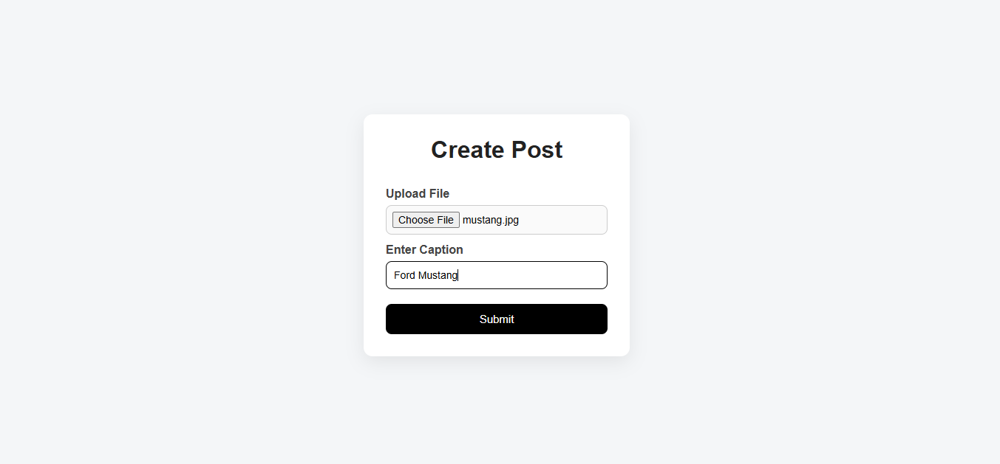
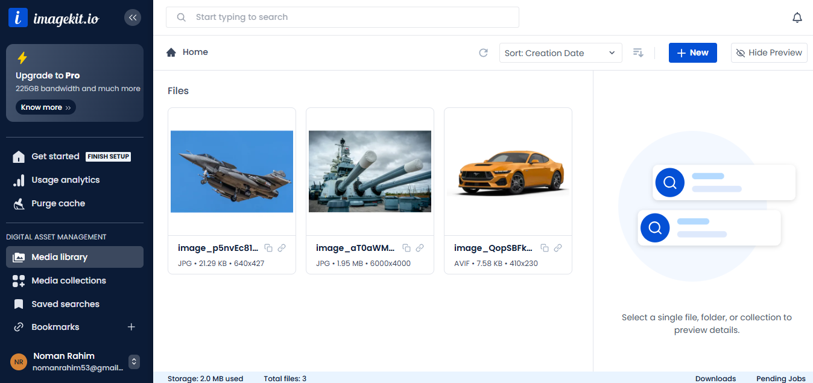
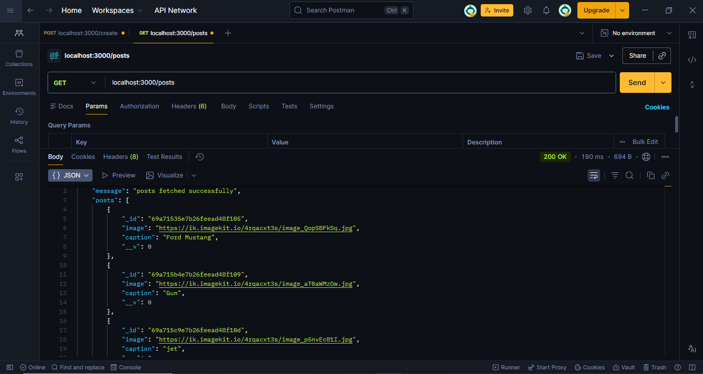
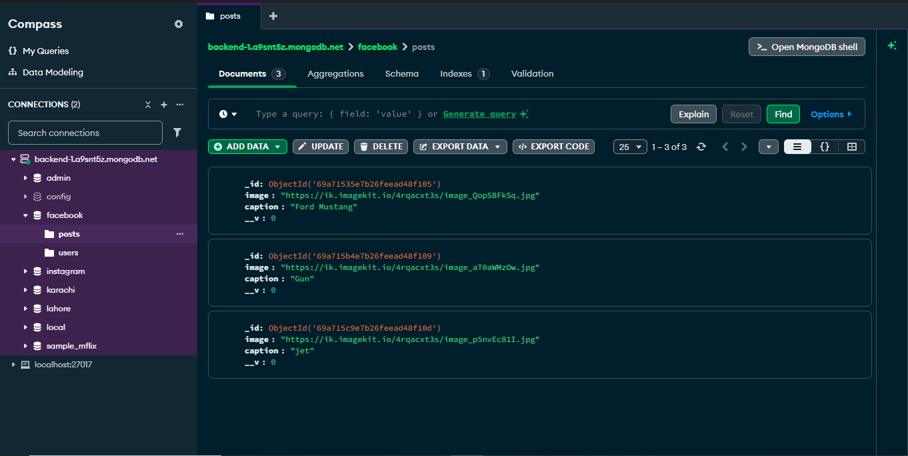

# 📸 MERN Post App

A full-stack social post application built using the **MERN Stack**.  
Users can create posts with captions and images, and view all posts in a dynamic feed.

Images are uploaded and managed using **ImageKit**, and data is stored in **MongoDB Atlas**.

---

## 🚀 Features

- Create post with image & caption
- Upload images using ImageKit
- View all posts in feed page
- RESTful API integration
- MongoDB Atlas cloud database
- Postman tested APIs
- Clean frontend UI

---

## 🛠️ Tech Stack

### Frontend
- React.js
- Axios
- CSS

### Backend
- Node.js
- Express.js
- MongoDB
- Mongoose

### Cloud & Tools
- ImageKit (Image Storage)
- MongoDB Atlas
- Postman

---

## 🔗 API Endpoints

| Method | Endpoint | Description |
|--------|----------|------------|
| POST   | /create-post | Create a new post |
| GET    | /posts       | Get all posts |

---

## 🗄️ Database

This project uses **MongoDB Atlas** cluster to store post data including:
- Image URL
- Caption
- Created time

---

## ☁️ Image Handling

Images are uploaded using **ImageKit**, which provides:
- Cloud image storage
- Optimized image delivery
- Fast CDN access

---

## 📸 Application Screenshots

### 🔹 Create Post Page

### 🔹 Feed Page

### 🔹 ImageKit Integration

### 🔹 API Testing - Get Posts

### 🔹 MongoDB Atlas Database

---

